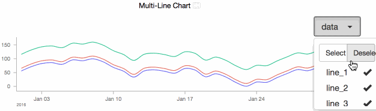

# mg-select
mg-select is an addon built for mozilla's metrics graphics in order to allow users to dynamically select `y_accessors` for line charts.
While working with on crash report projects, we wanted to be able to directly compare two of the potentially numerous `y_accessors` that we were graphing.



## Usage
As long as mg-select's javascript & css have been included, enable the addon with `mg_select: true`.
```js
MG.data_graphic({
  // ...
  mg_select: true
});
```

## Dependencies
mg-select requires the following libraries to be installed...
- `bootstrap-select` the jquery / bootstrap plugin that powers the overlays
- `boostrap` & `jquery` required by `bootstrap-select`

## Issues
The addon currently requires the fields `y_accessors` & `legend` to have the same array of variables.
This is an issue, because MG will initialize `args.y_accessors` to "multiline_...".
If there is any way to reference the old `y_accessors` I'll update the addon to avoid the requirement addressed.
